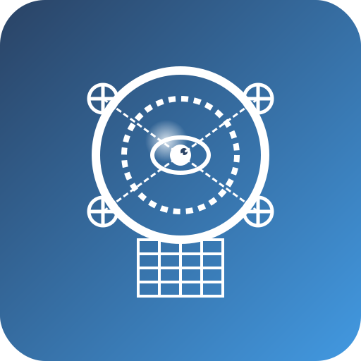

Welcome to OpenPerception's documentation!
=====================================

**OpenPerception** is a comprehensive, modular computer vision and perception framework designed for aerial robotics and drone applications. It provides a unified interface for implementing and integrating various perception tasks including SLAM, SfM, sensor fusion, mission planning, and deep learning.

.. toctree::
   :maxdepth: 2
   :caption: Contents:

   installation
   quickstart
   user_guide/index
   api/modules
   examples/index
   development/index
   citation <https://github.com/llamasearchai/OpenPerception>

Key Features
-----------

- **Visual SLAM** - Real-time simultaneous localization and mapping
- **Structure from Motion** - 3D reconstruction from image sequences
- **Sensor Fusion** - Integrate data from multiple sensors (cameras, IMU, GPS, LiDAR)
- **Mission Planning** - AI-powered mission planning using LLMs (OpenAI integration)
- **Deep Learning** - Object detection, segmentation, and classification
- **Path Planning** - RRT, RRT*, A* implementations for autonomous navigation
- **ROS2 Integration** - Seamless integration with the Robot Operating System
- **Visualization** - Powerful 3D visualization of SLAM results, point clouds, and more
- **Web Services** - FastAPI-based interface for remote control and monitoring
- **Deployment Tools** - Utilities for deploying to edge devices like NVIDIA Jetson

Quick Installation
----------------

.. code-block:: bash

   # Install from PyPI
   pip install openperception

   # Install with optional dependencies
   pip install "openperception[dev,deep_learning,ros2]"

Quick Start
----------

.. code-block:: python

   from openperception import OpenPerception

   # Initialize with default configuration
   app = OpenPerception()

   # Run SLAM on a video file
   results = app.run_slam_from_video("path/to/video.mp4")

   # Run Structure from Motion on a directory of images
   reconstruction = app.run_sfm_from_images("path/to/images")

   # Create a mission plan using AI
   plan = app.create_mission_plan(
       mission_description="Survey a 500m x 500m agricultural field",
       environment_description="Rural area with crops, some tall trees on the perimeter",
       constraints="Maximum altitude: 120m, Battery life: 20 minutes"
   )

Indices and tables
==================

* :ref:`genindex`
* :ref:`modindex`
* :ref:`search` 