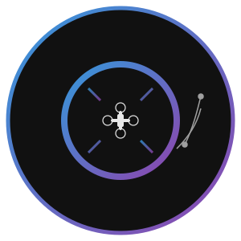

# OpenPerception

<div align="center">
  


[](https://opensource.org/licenses/MIT)
[](https://www.python.org/downloads/)
[](https://opencv.org/)
[](https://docs.ros.org/en/humble/)

</div>

**OpenPerception** is a comprehensive computer vision and perception framework for aerial robotics and autonomous systems. It integrates state-of-the-art algorithms for SLAM, Structure from Motion, sensor fusion, and more into a modular, production-ready architecture.

## 🚀 Features

- **Visual SLAM**: Real-time localization and mapping optimized for aerial platforms
- **Structure from Motion**: 3D reconstruction from image sequences
- **Sensor Fusion**: Multi-modal sensor data integration with Kalman filtering
- **Mission Planning**: AI-driven mission planning and execution
- **ROS2 Integration**: Seamless integration with the Robot Operating System 2
- **Benchmarking Tools**: Performance analysis and comparison framework
- **Deployment Utilities**: Easy deployment to embedded platforms like NVIDIA Jetson
- **Web Service API**: RESTful API for remote control and monitoring

## 📋 Requirements

- Python 3.8+
- OpenCV 4.5+
- NumPy
- PyTorch (for deep learning modules)
- ROS2 Humble+ (for ROS integration)
- FastAPI (for web services)

## 🔧 Installation

```bash
# Clone the repository
git clone https://github.com/llamasearchai/OpenPerception.git
cd OpenPerception

# Install dependencies
pip install -e .
```

## 🔍 Quick Start

```python
from openperception import OpenPerception
from openperception.config import load_config

# Load configuration
config = load_config()

# Initialize the framework
op = OpenPerception(config)

# Run visual SLAM on a video file
op.run_slam_from_video("path/to/video.mp4")

# Or perform 3D reconstruction with SfM
op.run_sfm_from_images("path/to/images/")
```

## 📊 Examples

Check out the [examples](OpenPerception/examples/) directory for sample applications:

- [Visual SLAM Example](OpenPerception/examples/slam/slam_example.py)
- [Structure from Motion Example](OpenPerception/examples/sfm/sfm_example.py)
- [Sensor Fusion Example](OpenPerception/examples/sensor_fusion/sensor_fusion_example.py)
- [Mission Planning Example](OpenPerception/examples/mission_planning/mission_planning_example.py)

## 📚 Documentation

Comprehensive documentation is available in the [docs](OpenPerception/docs/) directory.

## 🛠️ Project Structure

```
OpenPerception/
├── config/                # Configuration files
├── docs/                  # Documentation
├── examples/              # Example applications
├── src/                   # Source code
│   └── openperception/
│       ├── benchmarking/  # Performance benchmarking
│       ├── calibration/   # Camera calibration
│       ├── data_pipeline/ # Data management
│       ├── deep_learning/ # ML models
│       ├── deployment/    # Deployment utilities
│       ├── mission_planner/ # Mission planning
│       ├── ros2_interface/ # ROS2 integration
│       ├── sensor_fusion/ # Sensor fusion
│       ├── sfm/           # Structure from Motion
│       ├── slam/          # Visual SLAM
│       ├── utils/         # Utility functions
│       ├── visualization/ # Visualization tools
│       └── web_service/   # Web API
└── tests/                 # Tests
```

## 🤝 Contributing

We welcome contributions! Please check out our [contribution guidelines](CONTRIBUTING.md) for details.

## 📄 License

This project is licensed under the MIT License - see the [LICENSE](LICENSE) file for details.

## 📧 Contact

Nik Jois - nikjois@llamasearch.ai

Project Link: [https://github.com/llamasearchai/OpenPerception](https://github.com/llamasearchai/OpenPerception) 